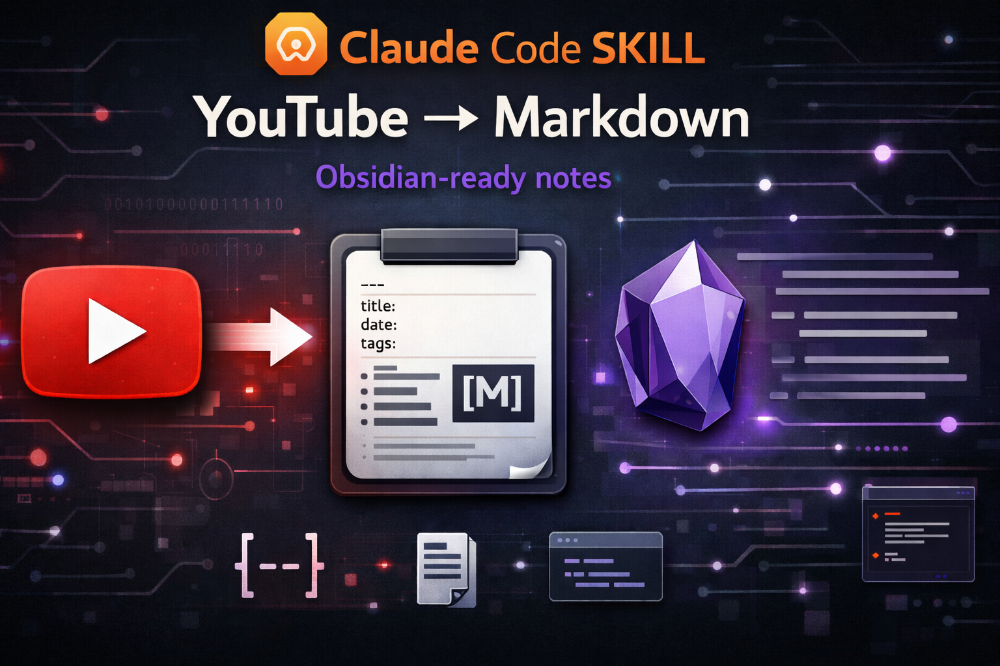

# YouTube Fetcher to Markdown

<p align="center">
  
</p>

YouTube video in, structured archival Markdown note out. Capture the transcript,
creator metadata, description, chapters, actual caption language, and provenance
in one Obsidian-ready file—without an API key.

```bash
npx skills add JimmySadek/youtube-fetcher-to-markdown
```

## What you get

Paste a YouTube link and receive a file such as:

```text
~/yt_transcripts/2026-03-04_obsidian-the-king-of-learning-tools_[hSTy_BInQs8].md
```

```markdown
---
title: "Obsidian: The King of Learning Tools (FULL GUIDE + SETUP)"
channel: "Odysseas"
url: "https://www.youtube.com/watch?v=hSTy_BInQs8"
video_id: "hSTy_BInQs8"
fetched: "2026-03-04"
source_project: "my-project"
language: "en"
caption_type: "manual"
duration: "36m 26s"
upload_date: "2024-04-24"
tags:
  - yt-transcript
---

# Obsidian: The King of Learning Tools (FULL GUIDE + SETUP)

## Video Details
| Field    | Value |
|----------|-------|
| URL      | https://www.youtube.com/watch?v=hSTy_BInQs8 |
| Channel  | Odysseas |
| Duration | 36m 26s |
| Uploaded | 2024-04-24 |
| Fetched  | 2026-03-04 |
| Source   | my-project |
| Language | en (manual) |

## Video Description
The creator's description, links, and chapter markers...

## Transcript
The complete caption text...
```

The YAML frontmatter makes a collection queryable through tools such as
[Dataview](https://github.com/blacksmithgu/obsidian-dataview), while the Markdown
remains portable to Logseq, other knowledge bases, and plain text workflows.

## Why this exists

Most transcript extractors stop at raw caption text. An archival knowledge note
also needs the source URL, creator, capture date, actual language, description,
chapters, and a predictable filename. YouTube Fetcher keeps that complete record
in one local file.

## Features

- Manual and auto-generated captions with optional timestamps
- Truthful language fallback: the note records the selected caption language
- Title, channel, duration, upload date, description, and chapters when available
- Safe YAML frontmatter and Markdown tables for dynamic metadata
- Duplicate detection that preserves existing notes unless overwrite is approved
- Obsidian-vault and custom-directory output
- Raw JSON and SRT export
- No API keys and no hosted service

## Installation

### Install the skill

```bash
npx skills add JimmySadek/youtube-fetcher-to-markdown
```

Or clone the canonical repository:

```bash
git clone https://github.com/JimmySadek/youtube-fetcher-to-markdown.git
```

### Install runtime dependencies

Python 3.8 or newer is supported.

```bash
python3 -m pip install -r requirements.txt
```

`yt-dlp` is optional but recommended for descriptions, chapters, duration, and
upload dates:

```bash
brew install yt-dlp              # macOS
# or: python3 -m pip install yt-dlp
```

Check dependencies without fetching a video:

```bash
python3 scripts/fetch_transcript.py --check-deps
```

The script reports missing packages but never installs them automatically.

## Usage

```bash
python3 scripts/fetch_transcript.py "https://youtu.be/VIDEO_ID"
```

An agent using the skill resolves `scripts/fetch_transcript.py` relative to its
installed `SKILL.md`; it does not depend on one fixed home-directory path.

### Output location

The first configured option wins:

1. `--output` for one exact file
2. `--output-dir` for this run
3. `YOUTUBE_FETCHER_DIR` for a persistent directory
4. `~/yt_transcripts/` by default

```bash
# Save this note to an Obsidian vault
python3 scripts/fetch_transcript.py URL --output-dir ~/Notes/MyVault

# Set a persistent default
export YOUTUBE_FETCHER_DIR=~/Notes/MyVault
python3 scripts/fetch_transcript.py URL

# Save to one exact file
python3 scripts/fetch_transcript.py URL --output ~/Notes/video.md
```

Duplicate detection uses the resolved output directory. In a non-interactive
session, an existing note exits with code `3` and remains untouched. Run again
with `--force` only after deciding to overwrite.

### Options

| Flag | What it does |
|------|-------------|
| `--output` / `-o` | Save to one exact file |
| `--output-dir` | Save inside a directory or knowledge vault |
| `--timestamps` / `-t` | Add timestamps to transcript lines |
| `--lang` / `-l` | Request a caption language; falls back truthfully to English |
| `--source` / `-s` | Override the capture-project name |
| `--format` / `-f` | Export `json` or `srt` instead of Markdown |
| `--no-description` | Skip the description and chapters section |
| `--stdout` | Print the result instead of saving it |
| `--list` | Show available caption languages |
| `--force` | Bypass duplicate protection |
| `--check-deps` | Report dependency status |

### Supported YouTube inputs

- Standard watch URLs, regardless of query-parameter order
- `youtu.be` short links
- `/embed/`, `/shorts/`, `/live/`, and legacy `/v/` links
- Mobile and YouTube Music watch URLs
- Privacy-enhanced `youtube-nocookie.com/embed/` links
- A raw 11-character video ID

Lookalike hosts such as `youtube.com.example.org` are rejected.

## Compatibility

The repository follows the portable `SKILL.md` format. The same install command
works with Codex, Claude Code, Cursor, Windsurf, Gemini CLI, and other compatible
agents. Manual users can run the Python script directly.

## Capabilities and limitations

- **Network:** contacts YouTube captions and oEmbed; optionally invokes `yt-dlp`
  for richer metadata.
- **Filesystem:** reads Markdown frontmatter in the selected directory to detect
  duplicates and writes only the requested Markdown, JSON, or SRT output.
- **Subprocess:** uses the locally installed `yt-dlp` executable when available.
- Videos must expose captions. Private, restricted, or caption-disabled videos
  may fail.
- It does not download video, run Whisper, identify speakers, or translate text.

<details>
<summary>Exit codes</summary>

| Code | Meaning |
|------|---------|
| `0` | Success |
| `1` | Invalid input or fetch failure |
| `2` | Missing required dependency |
| `3` | Existing note preserved; overwrite not approved |

</details>

## License

MIT
